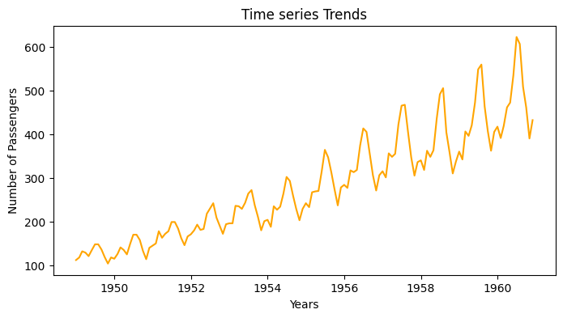

# Time Series Forecasting - Airline Passenger Prediction

This project focuses on forecasting airline passenger numbers using Time Series Analysis. The primary goal is to predict future passenger counts based on historical data.

## Getting Started

To run this project, you can follow these steps:

1. Clone the repository to your local machine:

```bash
git clone https://github.com/ALKRIS-55/Forecasting.git
```

## Project Structure
1. Time_Series_Forecasting.py: Python script containing the entire project code.
2. airline.csv: Dataset containing historical data on airline passengers.

## Project Overview
1. Dataset Overview
The dataset contains time series data with two columns: 'Month' and 'Passengers'. The 'Month' column is initially of type 'Object', and it is converted to the 'datetime' datatype for analysis.

2. Exploratory Data Analysis
Visualized time series trends to observe the upward trend and potential seasonality.
Plotted seasonality patterns to identify peak passenger months, highlighting July as the month with the highest passenger count.

![Seasonality] (TIME_SERIES/Pattern_in_time_series(Seasonality).png)


4. Stationarity Check
Performed Dickey-Fuller test to check stationarity. Identified that the original data is not stationary due to a increasing mean.

5. Data Transformation
Applied log transformation to stabilize the variance.
Differenced the log-transformed series to achieve stationarity.
6. Forecasting Model - ARIMA
Used Auto Correlation Function (ACF) and Partial Auto Correlation Function (PACF) to determine optimal parameters (p, d, q) for the ARIMA model.
Created ARIMA model with selected parameters and fitted it to the differenced log-transformed data.
Predicted future passenger counts and plotted the results.
Results
The ARIMA model successfully captured the underlying patterns in the time series data and provided forecasts for future passenger counts.
Plots and visualizations are available in the notebook to illustrate the entire process.
Future Work
Further optimization of the model parameters.
Exploration of additional time series forecasting methods.
Integration of external factors that may influence passenger numbers.
